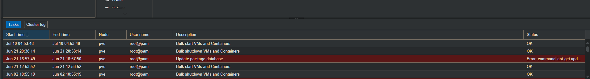
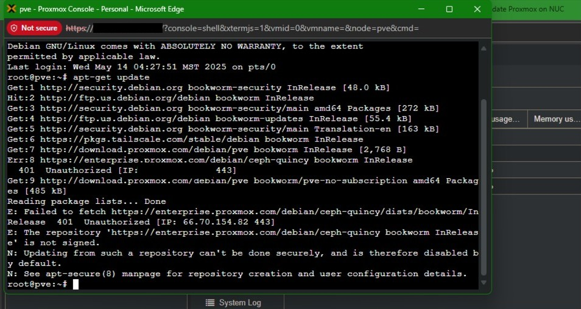
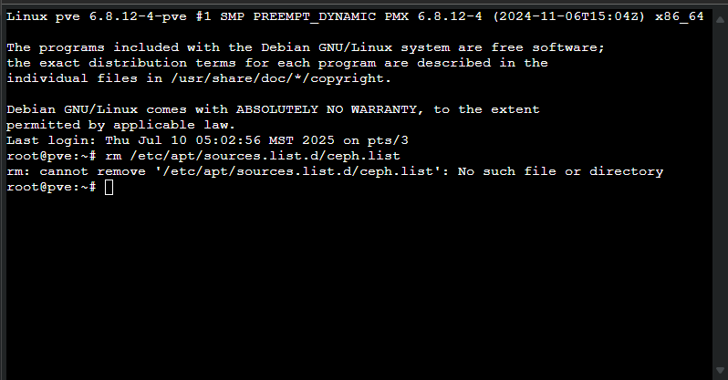
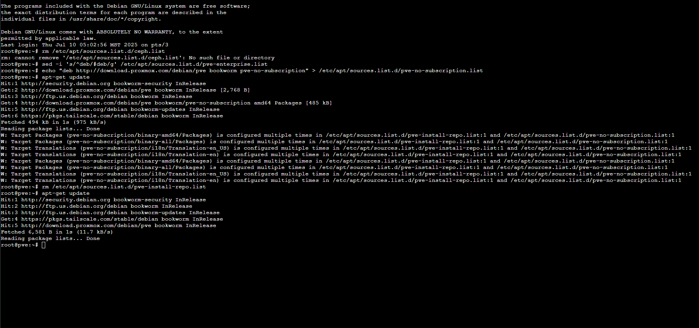
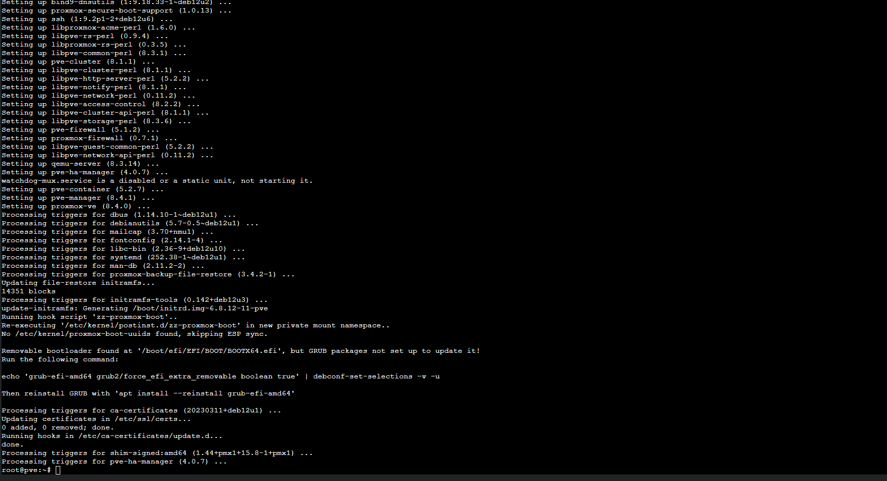
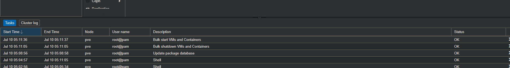

# Error #1 – Proxmox Package Database Update Failure  

**Context (what I was doing):**  
Attempting to update the package database on my Intel NUC Proxmox host (`apt-get update`) before upgrading Proxmox and installing additional packages for my SOC lab.  

**Error Message:**  
Err:6 https://enterprise.proxmox.com/debian/ceph-quincy
 bookworm InRelease
401 Unauthorized [IP: REDACTED_IP]
E: Failed to fetch https://enterprise.proxmox.com/debian/ceph-quincy/dists/bookworm/InRelease
E: The repository 'https://enterprise.proxmox.com/debian/ceph-quincy
 bookworm InRelease' is not signed.
 
 
**Root Cause:**  
The default **Proxmox Enterprise repository** requires a paid subscription. My installation was pointing at enterprise repos (`pve-enterprise` and `ceph-quincy`), which blocked updates since no valid subscription key was present.  

**Fix Applied:**  
1. Disabled enterprise repo lines in `/etc/apt/sources.list.d/pve-enterprise.list`.  
2. Added the **Proxmox no-subscription repo**:  
   ```bash
   echo "deb http://download.proxmox.com/debian/pve bookworm pve-no-subscription" \
   > /etc/apt/sources.list.d/pve-no-subscription.list
Re-ran apt-get update — success.

Lesson Learned:

Proxmox defaults to enterprise repos that block updates without a subscription.

Always switch to the no-subscription repo for labs.

Later, I added Tailscale for remote access to Proxmox, making troubleshooting from anywhere easier.

### Evidence

**Failure in GUI**


**Exact console error (401 Unauthorized + unsigned ceph-quincy repo)**


**Fix applied (disable enterprise, add no-subscription)**


**`apt-get update` succeeds (only W: warnings)**


**Upgrade finishes cleanly**


**Back to green in Proxmox tasks**

