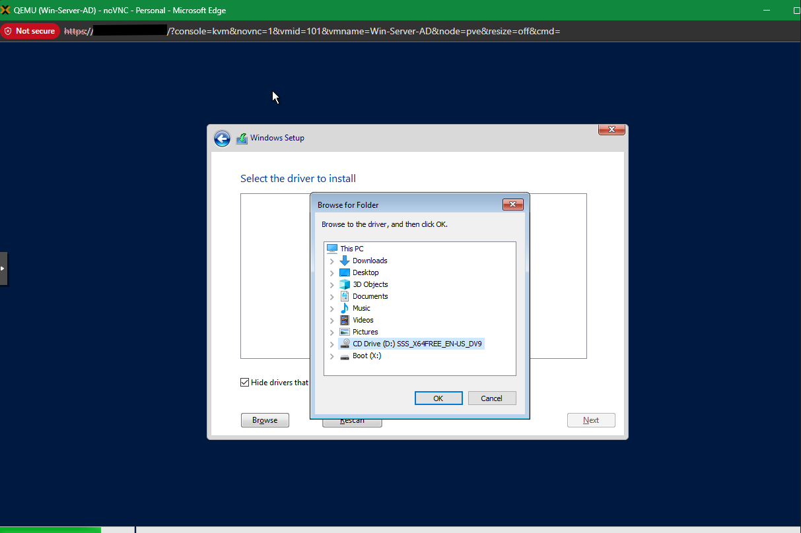
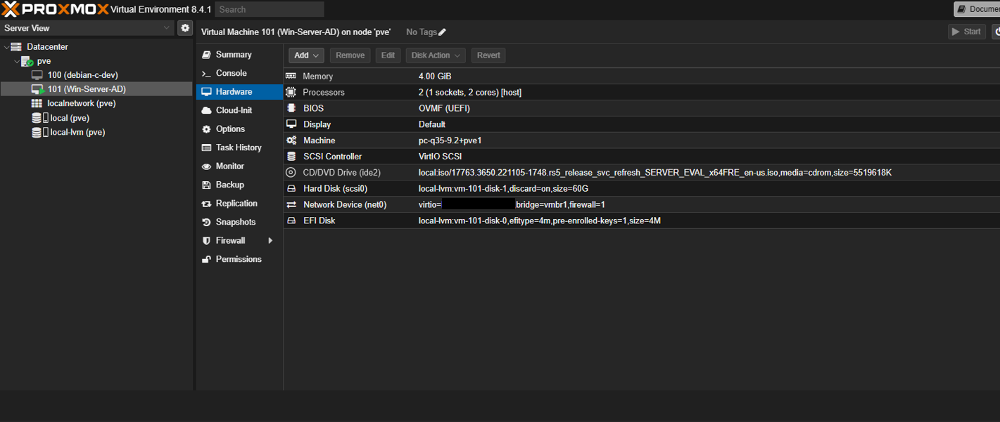
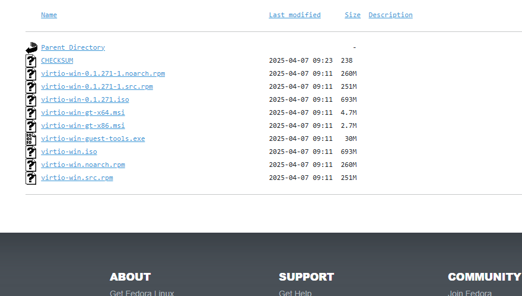
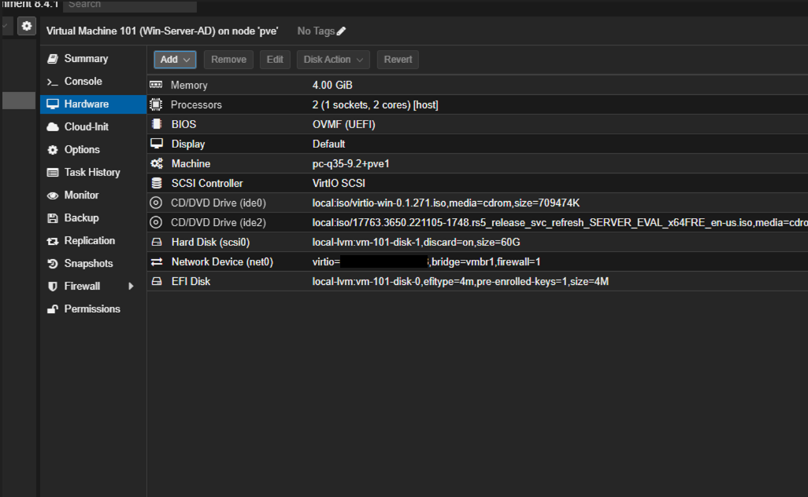
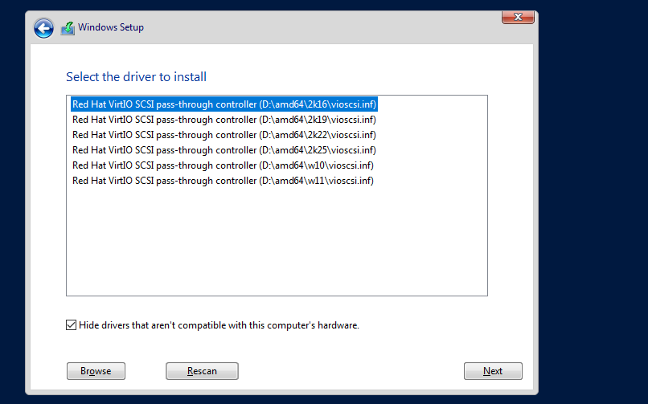
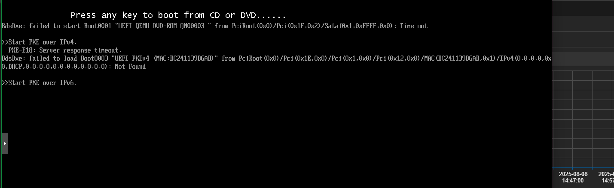
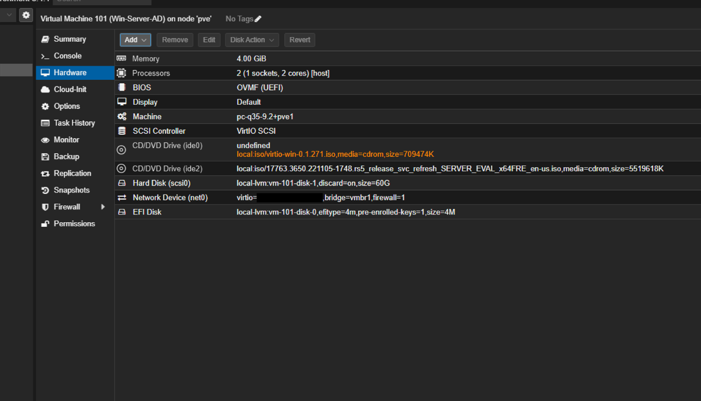
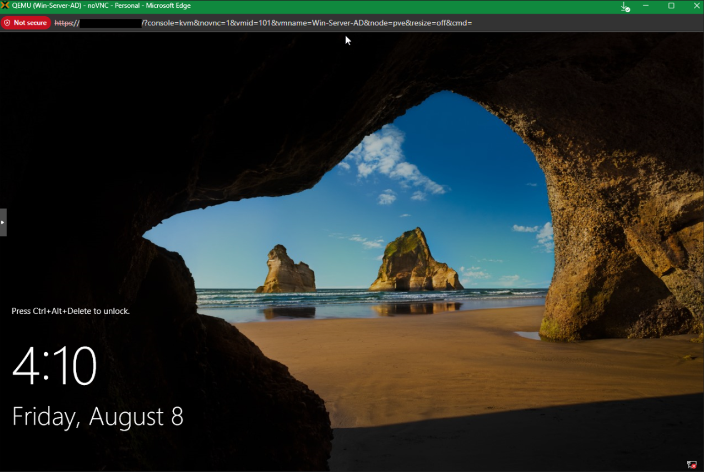

# Error #2 – VirtIO Driver Missing During Windows Server Setup

## Context (what I was doing)
While installing Windows Server 2019 as a VM on Proxmox (q35 machine, OVMF UEFI, VirtIO SCSI controller), I selected VirtIO for both the disk and network to maximize performance. During installation, Windows Setup could not detect the virtual hard disk.

## Error Message
Windows installer displayed:

> “No drives were found. Click Load driver to provide a mass storage driver for installation.”

## Root Cause
The Windows Server ISO does not include VirtIO storage/network drivers by default. Because the VM disk was presented as VirtIO SCSI, the installer had no compatible driver to recognize the disk.

## Fix Applied
- Verified VM was configured with VirtIO SCSI + VirtIO NIC in Proxmox.  
    

- Attempted Windows install, hit *no drives detected*.  
    

- Downloaded the official VirtIO ISO (`virtio-win-0.1.271.iso`) from Fedora.  
    

- Attached the VirtIO ISO as a secondary CD drive in Proxmox.  
    

- From Windows Setup, loaded drivers from the VirtIO ISO → selected *Red Hat VirtIO SCSI pass-through controller (w10/amd64)*.  
    

- After loading the drivers, Windows installation proceeded. However, on first boot the VM failed with PXE-over-IPv6 errors:  
    

- The issue was caused by Proxmox attempting to boot via IPv6 network instead of the installed disk.  
- **Fix:** Manually unchecked IPv6 in the VM’s network settings, leaving only IPv4 enabled. Once disabled, the VM booted normally from disk.  

- Proxmox occasionally showed the VirtIO ISO as “undefined” in the hardware tab, but installation still succeeded.  
    

- Installation completed successfully, VM booted into Windows.  
    

## Lesson Learned
Whenever using VirtIO SCSI or NIC on Windows VMs in Proxmox, **always attach the VirtIO driver ISO** during setup so the installer can detect the disk.  

Additionally, if PXE boot issues appear after install, check NIC settings. **Disabling IPv6** can prevent the VM from attempting unwanted network boots.
