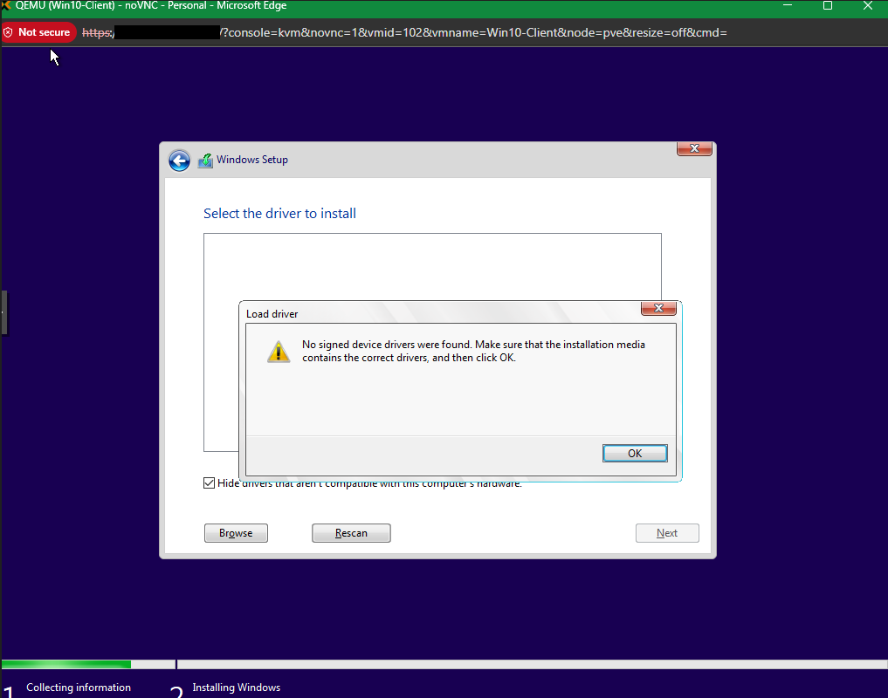
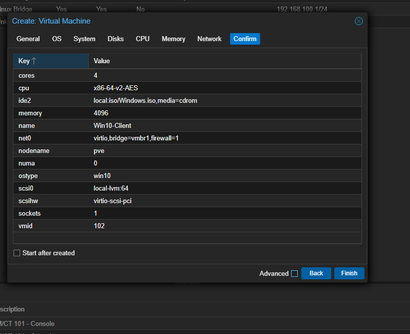
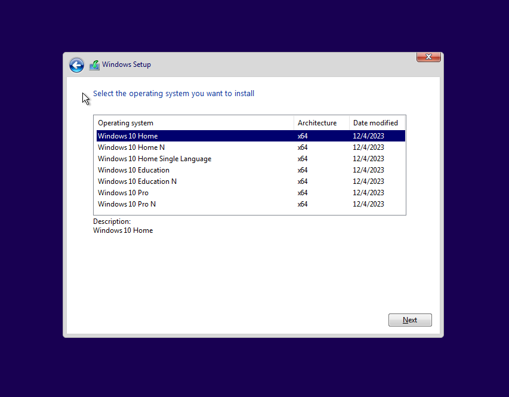
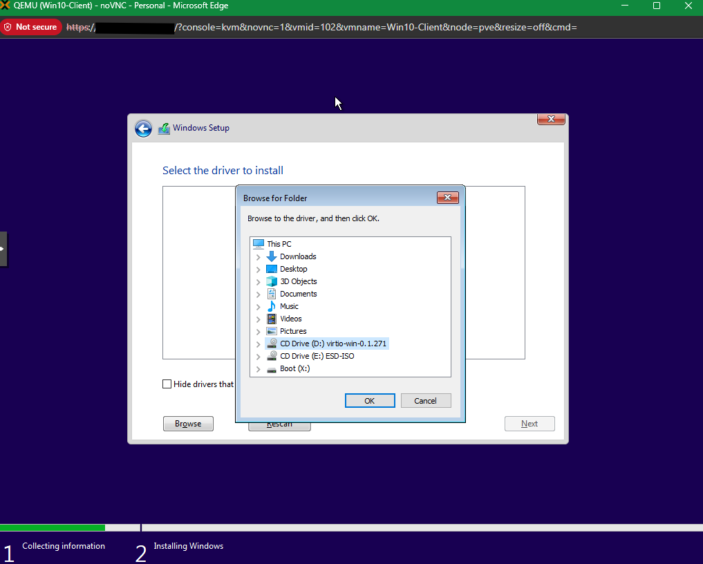
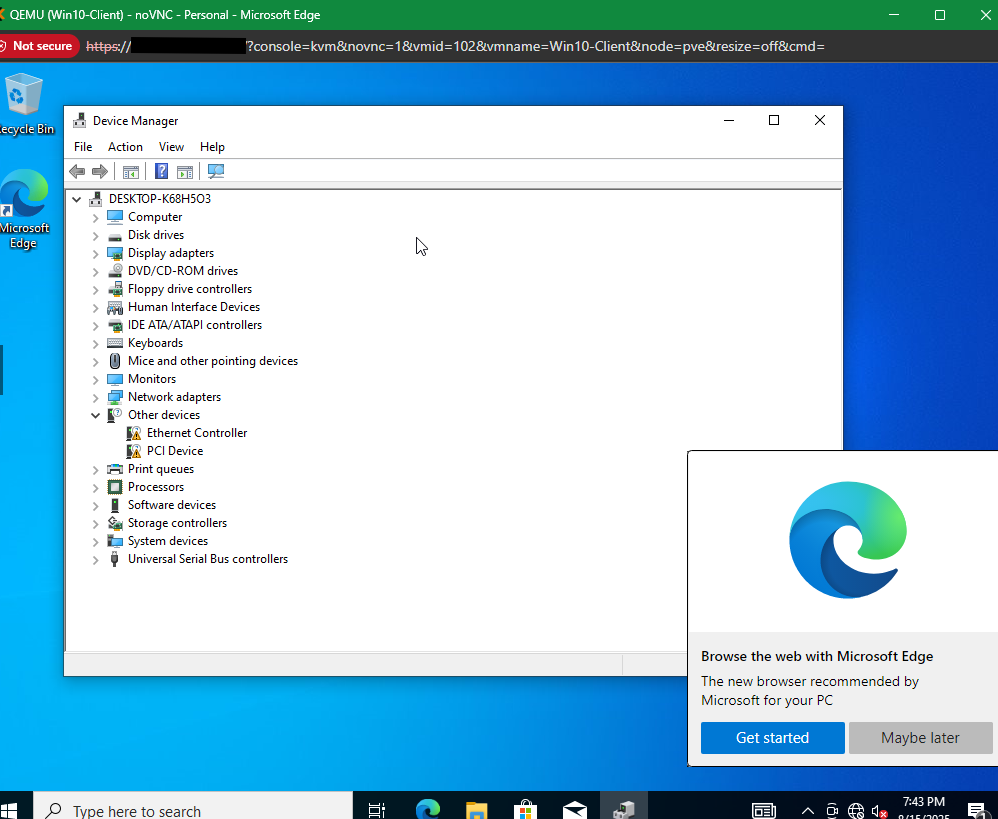
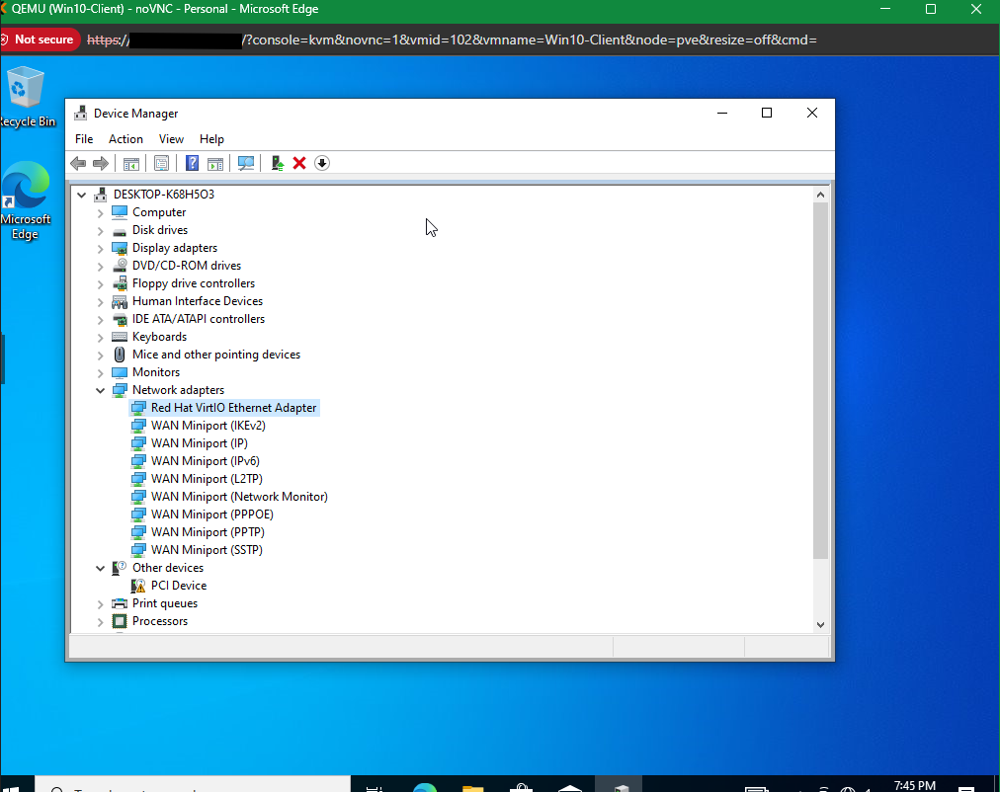
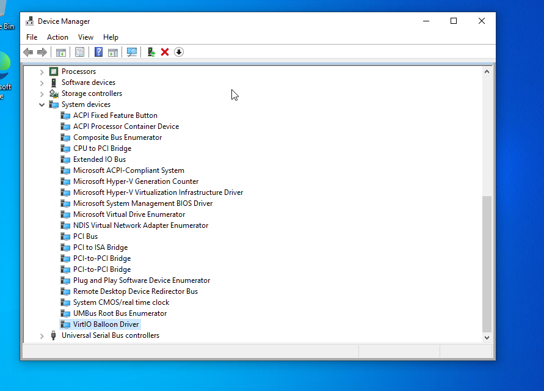
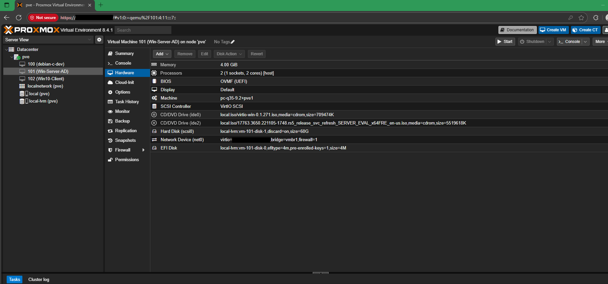

# Error #04 – VirtIO Driver “No Signed Device Drivers” During Windows 10 Client Setup

## Context (What I Was Doing)
While installing a Windows 10 Client VM on Proxmox (q35 machine, OVMF UEFI, VirtIO SCSI controller), I selected VirtIO for both the disk and network. During Windows Setup, the installer rejected the VirtIO drivers.

## Error Message
Windows installer displayed:

> “No signed device drivers were found. Make sure that the installation media contains the correct drivers, and then click OK.”

## Root Cause
The Windows 10 ISO does not include VirtIO drivers by default. When I first attempted to load them, I browsed the wrong location on the VirtIO ISO, causing Setup to report the drivers as “unsigned.”

## Fix Applied
- Created the Windows 10 Client VM in Proxmox with VirtIO SCSI + VirtIO NIC.  
  

- Started Windows Setup and selected the OS edition.  
  

- Hit the error when trying to load drivers.  
  

- Attached the official VirtIO ISO (`virtio-win-0.1.271.iso`) as a secondary CD drive in Proxmox.  
- From Windows Setup, manually browsed into the VirtIO ISO:  
    

  - For disk: `viostor\w10\amd64`  
  - For network: `NetKVM\w10\amd64`  

- Installation continued successfully. After first boot, Device Manager showed missing devices (Ethernet + PCI).  
  

- Installed VirtIO NIC driver → NIC detected as **Red Hat VirtIO Ethernet Adapter**.  
  

- Installed VirtIO Balloon driver under System devices.  
  

- VM fully added and operational as a Windows 10 Client.  
  

## Lesson Learned
Windows 10, like Server 2019, does not ship with VirtIO drivers. The error “No signed device drivers were found” occurs if:  
- The wrong path is browsed, or  
- The VirtIO ISO is missing.  

**Fix:** Always attach the VirtIO ISO and load the correct OS-specific driver folder (`w10\amd64`). After install, update remaining devices (NIC, Balloon, etc.) from the VirtIO ISO to ensure full functionality.
