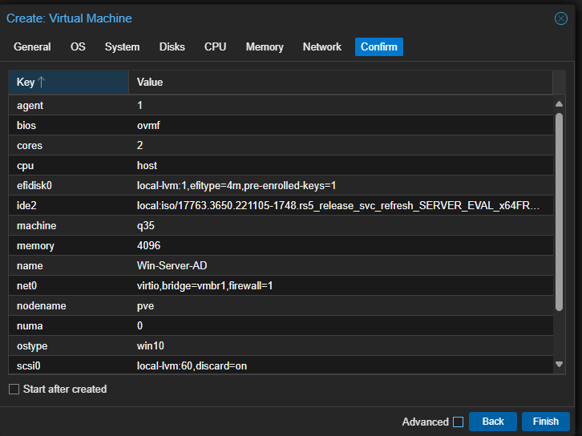

# Error #2 – VirtIO Driver Missing During Windows Server Setup

**Context (what I was doing)**  
While installing **Windows Server 2019** as a VM on **Proxmox** (q35 machine, OVMF UEFI, VirtIO SCSI controller), I selected VirtIO for both the disk and network to maximize performance. During installation, Windows Setup could not detect the virtual hard disk.

---

**Error Message**  
Windows installer displayed:  

> *“No drives were found. Click Load driver to provide a mass storage driver for installation.”*  

---

**Root Cause**  
The Windows Server ISO does not include **VirtIO storage/network drivers** by default. Because the VM disk was presented as VirtIO SCSI, the installer had no compatible driver to recognize the disk.

---

**Fix Applied**  
1. Verified VM was configured with VirtIO SCSI + VirtIO NIC in Proxmox.  
     
   

2. Confirmed hardware view before fix — only Windows ISO + disk attached.  
   

3. Attempted Windows install, hit *no drives detected*.  
   

4. Tried browsing for drivers on current media — nothing useful found.  
   

5. Downloaded the official **VirtIO ISO** (`virtio-win-0.1.271.iso`) from Fedora.  
   

6. Attached the VirtIO ISO as a secondary CD drive in Proxmox.  
   

7. From Windows Setup, loaded drivers from the VirtIO ISO → selected  
   **Red Hat VirtIO SCSI pass-through controller (w10/amd64)**.  
   

8. Installer immediately detected the disk → installation continued.  
   

9. Installation completed successfully, VM booted into Windows.  
   

---

**Lesson Learned**  
- Windows ISOs do **not** ship with VirtIO drivers; always mount the VirtIO ISO alongside the OS ISO when creating a VM.  
- The correct driver depends on OS version — for Server 2019, use the `w10/amd64` folder.  
- Without this step, Windows cannot see the virtual disks or NICs when VirtIO is used.

---

**File Naming**  
- Documentation file: `error-2-virtio-driver.md`  
- Screenshot folder: `Error-2/`  
- Screenshots:  
  - `01-vm-system-virtio-scsi.png`  
  - `02-vm-network-virtio.png`  
  - `03-hardware-pre-fix.png`  
  - `04-no-drives-load-driver.png`  
  - `05-browse-to-virtio-iso.png`  
  - `06-virtio-iso-added.png`  
  - `07-hardware-with-2-isos.png`  
  - `08-select-viostor-w10-amd64.png`  
  - `09-disk-detected-install.png`  
  - `10-first-boot-success.png`
