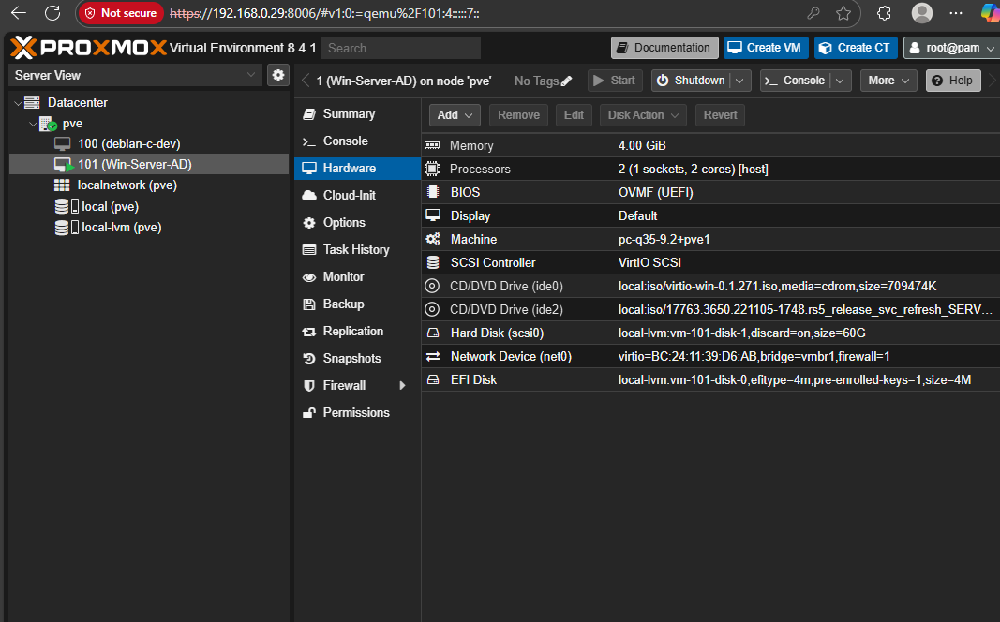
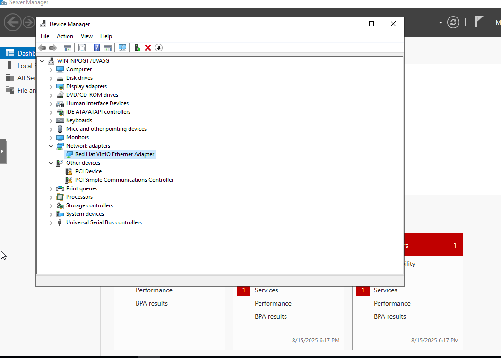
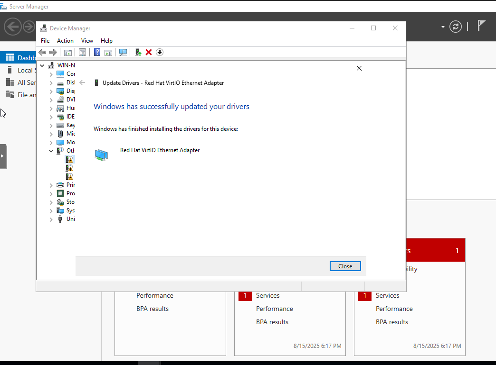

# Error #3 – VirtIO NIC Driver Missing

## Context (What I Was Doing)
While configuring the Windows Server 2019 VM (**Win-Server-AD**) on Proxmox with a VirtIO network adapter, Device Manager showed the NIC was not recognized. The VM had no working network connectivity.

## Error Message
Device Manager displayed the NIC under **Other devices** as *Ethernet Controller* with a yellow exclamation mark.

First, in Device Manager, the NIC showed as missing:  

## Root Cause
Windows Server installation media does not ship with VirtIO drivers. Since the VM network interface was configured as a **Red Hat VirtIO Ethernet Adapter**, the OS could not automatically load a driver.

## Fix Applied
I mounted the VirtIO ISO (`virtio-win-0.1.271.iso`) in Proxmox as a secondary CD drive:  

Next, I opened Device Manager → *Right-click NIC → Update Driver → Browse*:  

Then, I navigated to the VirtIO ISO contents and selected the appropriate driver:  

Finally, the Red Hat VirtIO Ethernet Adapter driver installed successfully:  

At this point, the NIC appeared correctly under *Network adapters* without warnings.

## Lesson Learned
When using VirtIO hardware for Windows VMs in Proxmox, VirtIO drivers must be installed manually from the ISO. Always keep the VirtIO ISO mounted during installation/configuration to resolve missing device driver errors quickly.
