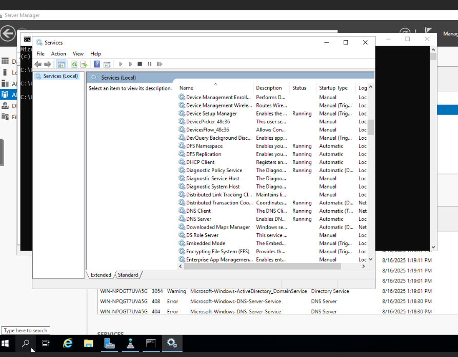
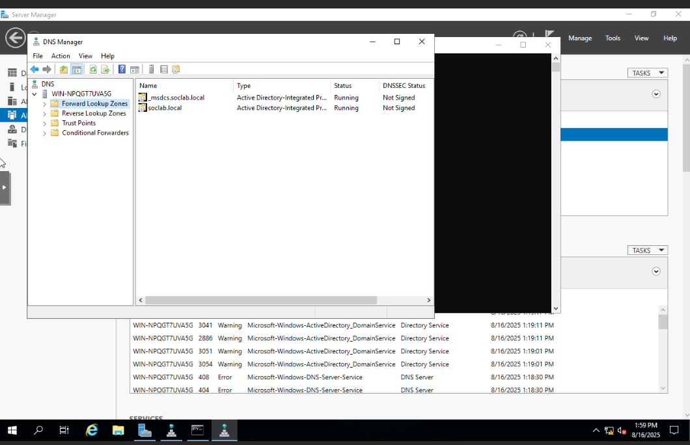
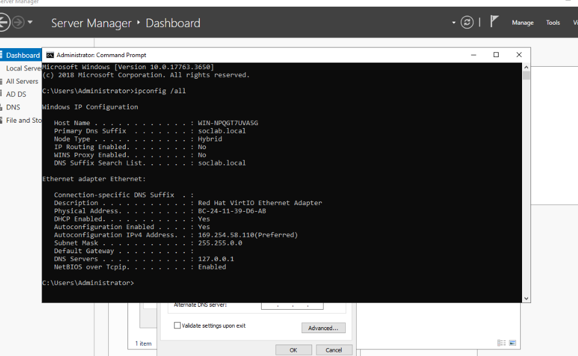
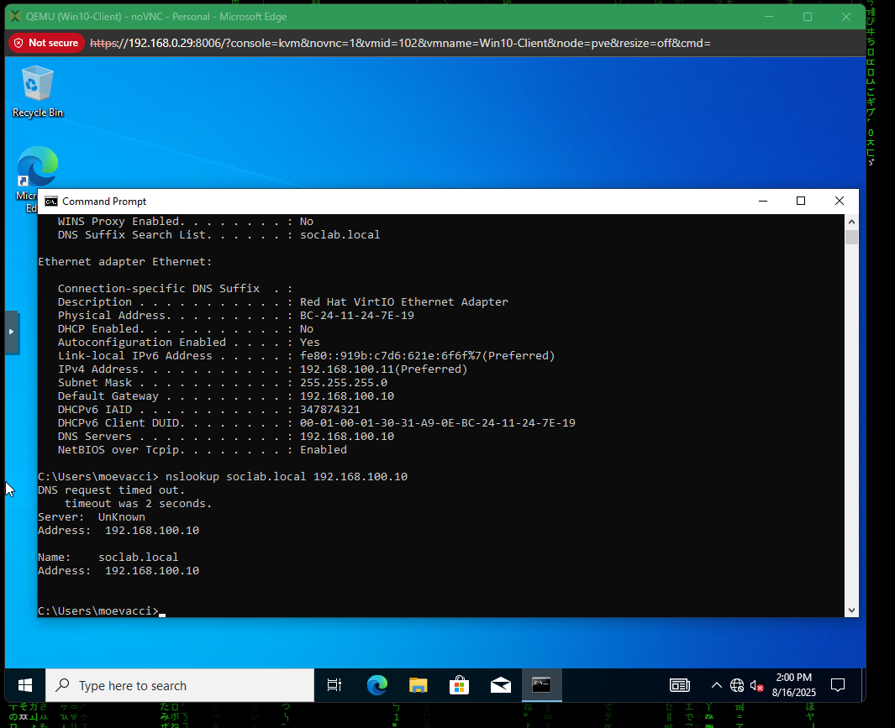
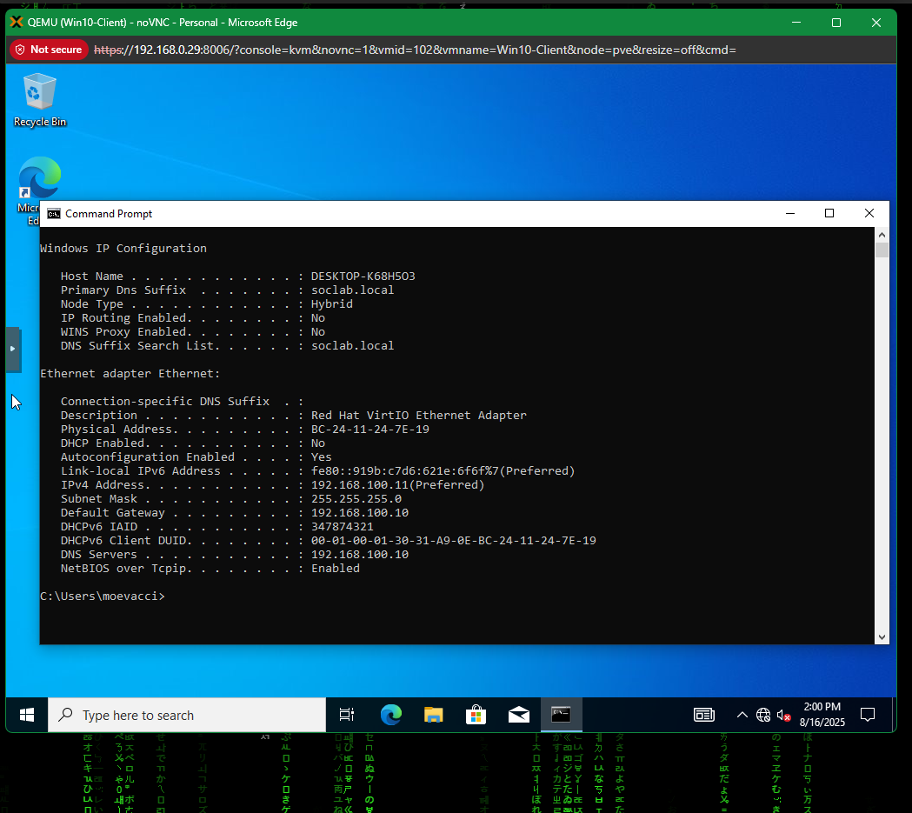
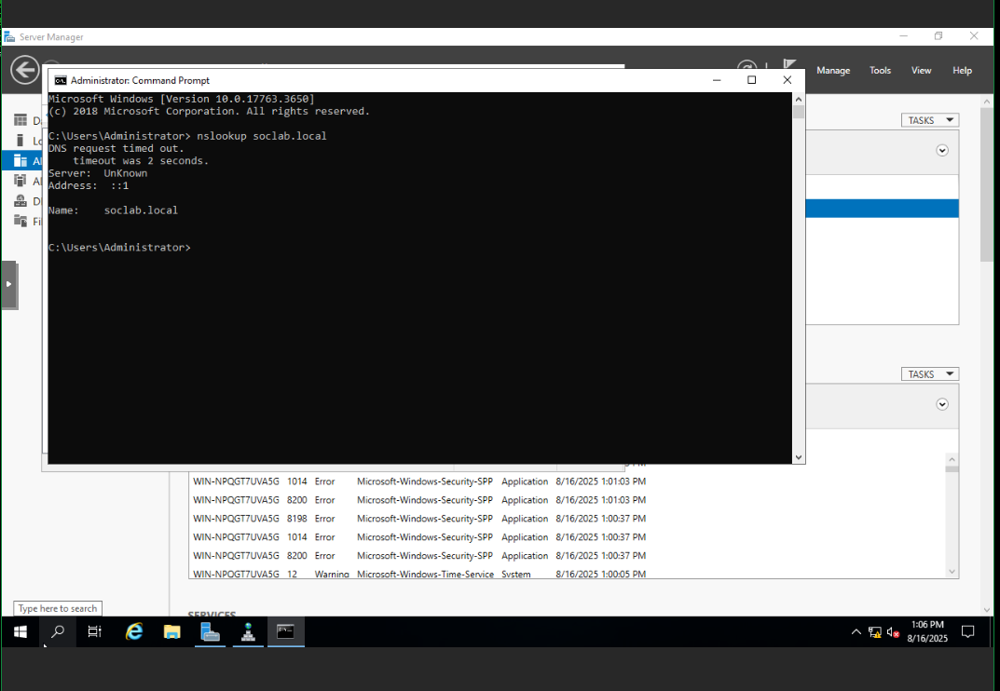

# Error #5 – DNS Resolution Fails with IPv6 (nslookup soclab.local Timeout)

## Context (What I Was Doing)  
While testing domain resolution after setting up Active Directory (AD DS) and DNS on the Server 2019 VM, I attempted to validate that the Windows 10 client could query the domain `soclab.local`.  

Although `ping` worked, `nslookup soclab.local` was failing under certain conditions, specifically when the client defaulted to IPv6 (`::1`) instead of IPv4.  

---

## Error Message  
When running:  

nslookup soclab.local

The output returned:  

DNS request timed out.
timeout was 2 seconds.
Server: Unknown
Address: ::1

---

## Error Screenshots  

First, I checked that DNS services were running on the domain controller.  
  

Next, I confirmed the Forward Lookup Zones contained `soclab.local`.  
  

On the server, IP configuration showed the loopback DNS (`::1`) being used instead of IPv4.  
  

On the Windows 10 client, DNS was pointed at the domain controller.  
  

A ping test against `soclab.local` resolved correctly to the IPv4 address.  
  

Running `nslookup soclab.local` by default failed due to IPv6.  
  

Finally, forcing the query against the IPv4 address (`192.168.100.10`) succeeded.  
  

---

## Root Cause  
The DNS server and/or clients were resolving `soclab.local` using the IPv6 loopback (`::1`), which did not respond correctly to queries. This caused `nslookup` to fail even though `ping` worked, since `ping` automatically fell back to IPv4.  

---

## Fix Applied  
- Verified that the **DNS Server** service was running on the domain controller.  
- Forced client DNS configuration to point explicitly to the IPv4 address of the domain controller (`192.168.100.10`).  
- Re-ran `nslookup` with the IPv4 server specified:  

nslookup soclab.local 192.168.100.10

This succeeded, confirming the DNS records were correct.  

---

## Lesson Learned  
- Windows defaults to IPv6 for DNS queries if it’s available, even if IPv6 isn’t configured properly.  
- Always check both IPv4 and IPv6 paths when diagnosing DNS issues.  
- When building a lab, disabling IPv6 on adapters or forcing IPv4 DNS servers avoids unnecessary resolution failures.  

