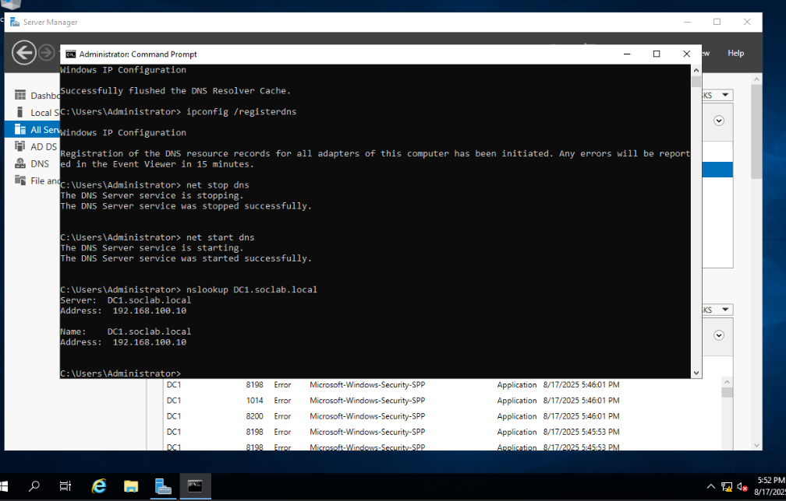
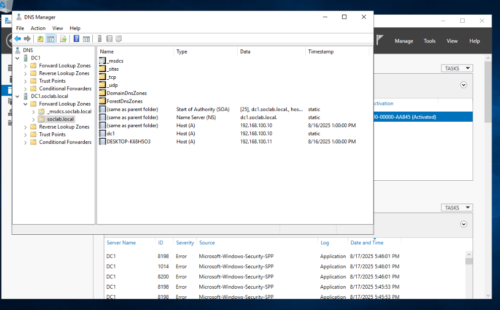
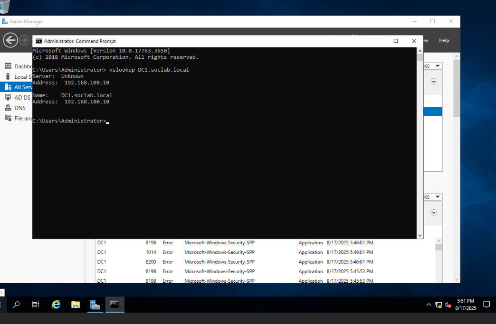

# Error #6 – DNS Resolution Failure During Domain Join  

## Context (What I Was Doing)  
I was attempting to join the Windows 10 client (192.168.100.11) to the `soclab.local` domain after promoting the Server 2019 VM (192.168.100.10) to a Domain Controller with DNS.  

Even though pings between client and server succeeded, DNS lookups (`nslookup`) were not resolving consistently, which prevented the domain join process.  

## Error Message  

### Client-side (192.168.100.11) – DNS request timed out  
  

### Server-side (192.168.100.10) – Non-existent domain  
  

## Root Cause  
- The **DNS service on the Domain Controller** had not fully registered its resource records after promotion.  
- The Forward Lookup Zone (`soclab.local`) existed but was incomplete until the DNS service was refreshed.  
- Client lookups were hitting stale or missing records in the DNS cache.  

## Fix Applied  

### Step 1 – Re-register DNS and restart service on Domain Controller  
  

### Step 2 – Verify Forward Lookup Zones in DNS Manager  
  

### Step 3 – Successfully join Windows 10 client to the domain  
  

## Lesson Learned  
- **DNS is critical for AD**: domain joins depend entirely on DNS, not just network connectivity.  
- Always run `ipconfig /registerdns` and restart the DNS service after promoting a Domain Controller.  
- Flush client caches to eliminate stale entries during troubleshooting.  
- Verify Forward Lookup Zones in DNS Manager before attempting domain joins.  
