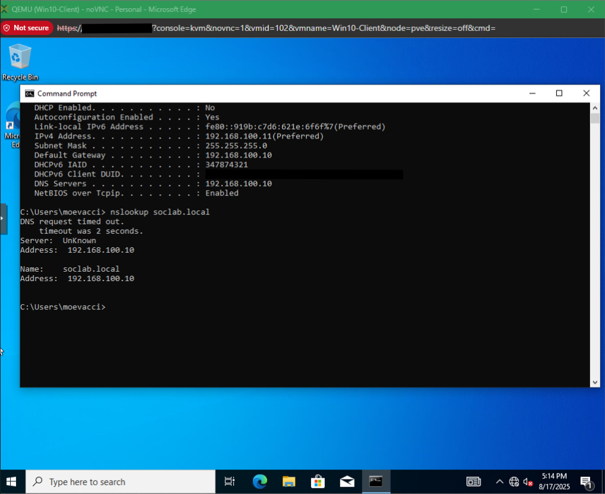
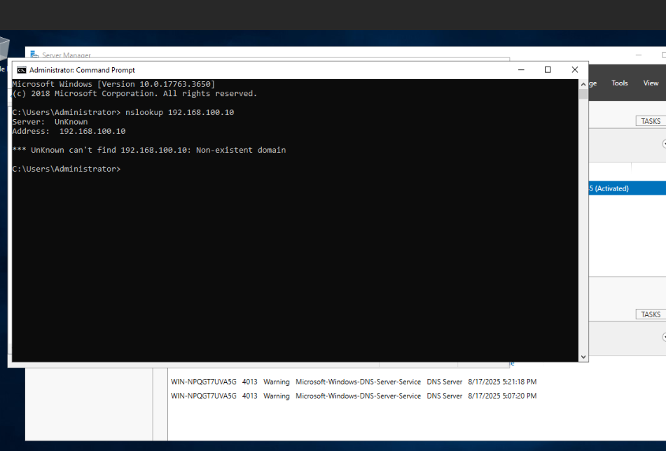

# Error #6 – DNS Resolution Failure During Domain Join  

## Context (What I Was Doing)  
While setting up Active Directory (AD DS) and DNS on the Server 2019 Domain Controller (`DC1` – 192.168.100.10), I attempted to join the Windows 10 client (`192.168.100.11`) to the `soclab.local` domain.  

Connectivity between the systems was fine — ICMP pings succeeded — but DNS queries (`nslookup`) were failing intermittently. This prevented the domain join process from completing.  

## Error Message  
From the Windows 10 client:  

C:\Users\moevacci> nslookup soclab.local
DNS request timed out.
timeout was 2 seconds.
Server: UnKnown
Address: 192.168.100.10

Name: soclab.local
Address: 192.168.100.10

css
Copy code

  

From the Domain Controller itself:  

C:\Users\Administrator> nslookup 192.168.100.10
*** UnKnown can't find 192.168.100.10: Non-existent domain

pgsql
Copy code

  

## Root Cause  
- The **DNS Server service on the Domain Controller** had not fully registered its resource records after promotion to Domain Controller.  
- **IPv6 priority** was interfering with name resolution, defaulting queries to ::1 instead of the IPv4 address.  
- Forward Lookup Zone (`soclab.local`) existed, but records were incomplete until the DNS service was restarted.  

## Fix Applied  
1. On the **Domain Controller (Server)**:  
   ```bash
   ipconfig /registerdns
   net stop dns
   net start dns
This forced DNS to re-register resource records and refresh service state.


On the Windows 10 Client:

bash
Copy code
ipconfig /flushdns
nslookup soclab.local
nslookup DC1.soclab.local
This cleared stale cache and confirmed correct responses from the DC.


Verified in DNS Manager that the Forward Lookup Zone contained both the DC1 record and the Windows 10 client host record.


Successfully joined the Windows 10 client to the soclab.local domain.


Lesson Learned
Active Directory depends entirely on DNS — pings alone are not enough to prove readiness.

Always flush and re-register DNS on the Domain Controller immediately after promotion.

Restarting the DNS Server service ensures records propagate correctly.

Client-side cache must also be flushed to avoid stale records blocking domain join.

