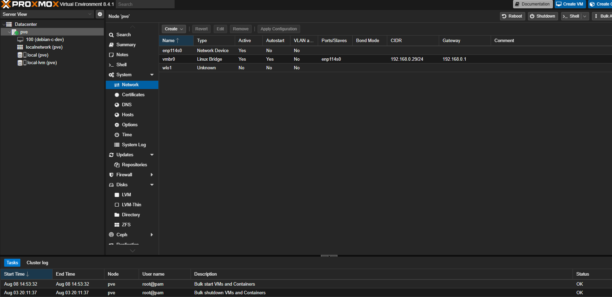
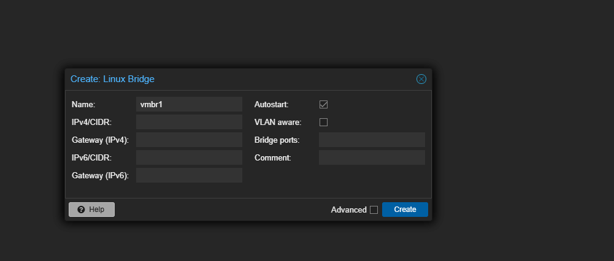

# Step 03 – Creating vmbr1 Isolated Bridge

**Context (what I was doing):**  
After setting up remote access with Tailscale, I needed an **isolated internal network** in Proxmox for SOC lab VMs. This ensures lab traffic (Windows Server AD, client machines, Security Onion, etc.) stays separate from my home LAN while still being routable inside the lab.

**Screenshots:**  
  

**Root Cause (why this step was needed):**  
By default, Proxmox only has `vmbr0` bridged to the physical NIC. This ties all VM traffic directly to the home LAN.  
For proper SOC isolation, I needed a second bridge (`vmbr1`) with no external gateway, dedicated to internal VM traffic only.

**Fix Applied / Action Taken:**  
1. Opened **Datacenter → Node → Network** in Proxmox.  
2. Clicked **Create → Linux Bridge**.  
3. Named the bridge `vmbr1`, left Gateway blank, and enabled **Autostart**.  
4. Saved and applied changes.  

Now `vmbr1` exists for assigning to internal SOC VMs.

**Lesson Learned:**  
- Proxmox defaults to a single bridge (`vmbr0`) mapped to the physical NIC.  
- Creating a new bridge without a gateway (`vmbr1`) is the cleanest way to separate **lab-only traffic** from the LAN.  
- This prevents SOC experiments from interfering with the home network and keeps traffic contained.  
