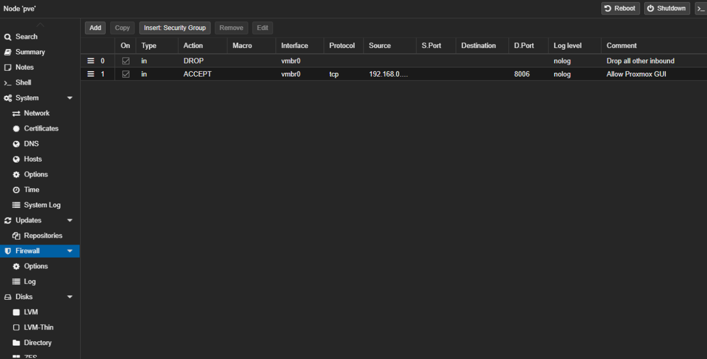
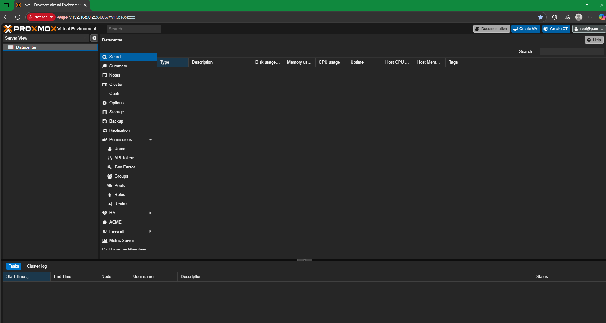
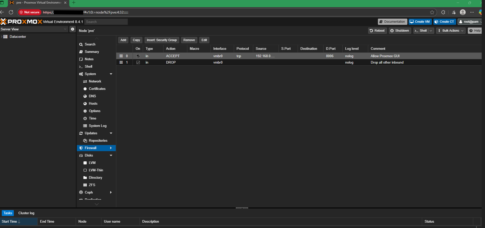

# Step 8 – Configuring Firewalls in Proxmox  

## Actions Taken  

1. **Enabled Proxmox Firewall**  
   - Opened the Firewall tab in Proxmox to add rules for `vmbr0`.  
   - Initially created an ALLOW rule for port 8006 (Proxmox GUI) and a DROP rule for all other inbound traffic.  

     

2. **Discovered Rule Ordering Issue**  
   - Learned that firewall rules in Proxmox are processed **top to bottom**.  
   - Because the DROP rule was above the ALLOW rule, the GUI was blocked, locking me out of the web interface.  

     

3. **Recovered Access from Proxmox CLI**  
   - Connected a keyboard and mouse directly to the Intel NUC.  
   - Disabled the firewall using the **Proxmox host command line** to restore GUI access.  

4. **Reordered Rules and Verified Access**  
   - Corrected the rule order: placed the ALLOW rule above the DROP rule.  
   - Verified the Proxmox GUI remained accessible while other inbound connections were blocked.  

     

## Lesson Learned  
- Proxmox firewall rules are **order-dependent** — the first matching rule applies.  
- Always put ALLOW rules before DROP rules to avoid accidental lockouts.  
- If locked out, direct console access to the Proxmox host is required to disable or adjust firewall rules.  
- Configuring these firewalls improved lab security awareness before deploying VM's that may need internet access for updates, ensuring the isolated SOC lab network remained contained.  
