# Step 9 – Configuring the Splunk Server
## Context

At this stage, I had already installed Ubuntu Server inside Proxmox and assigned it a static IP address. The goal of this step was to transfer the Splunk installation package into the VM, install it, configure initial admin credentials, and ensure that the Splunk Web interface was accessible.

## Screenshots

First, I configured the static IP and DNS servers for the Splunk VM.  
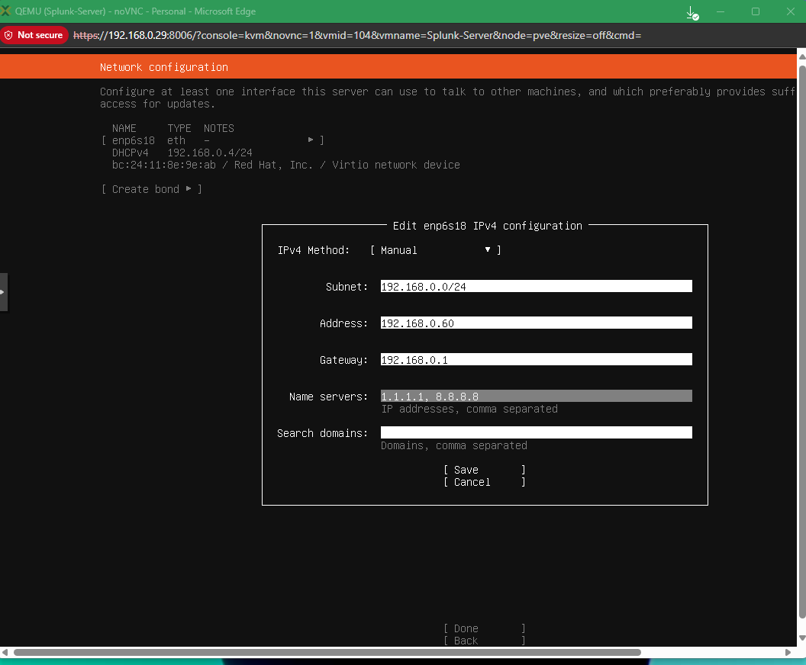

Then I verified the VM’s network details in Proxmox and checked the installation logs during Ubuntu setup.  
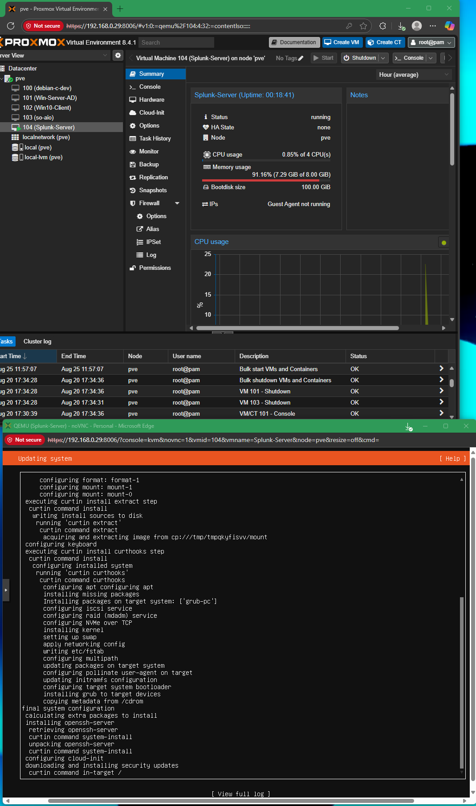  
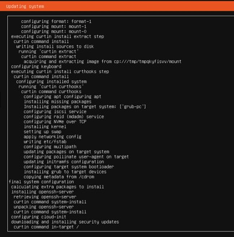

After reboot, I confirmed the assigned IP using ip a on the Splunk server.  
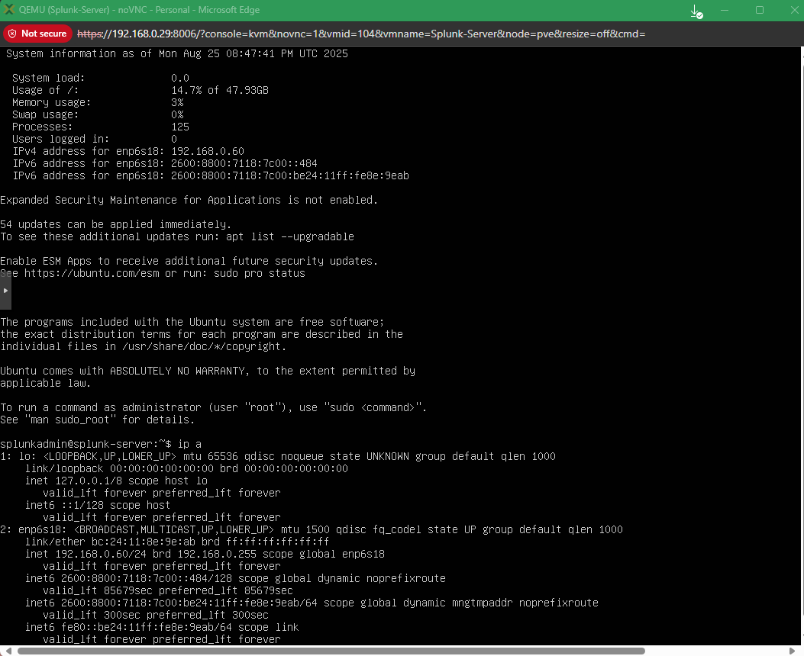

On my Windows host, I navigated to the ISO directory where I stored the Splunk .deb installer.  
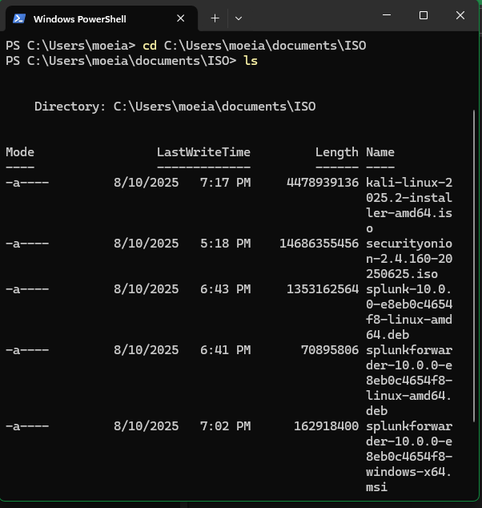

I used scp to securely copy the Splunk .deb package into the Splunk server’s home directory.  
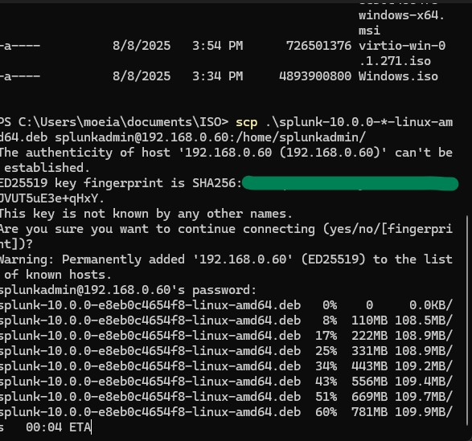

Once copied, I installed the .deb package with dpkg -i and started the service.  
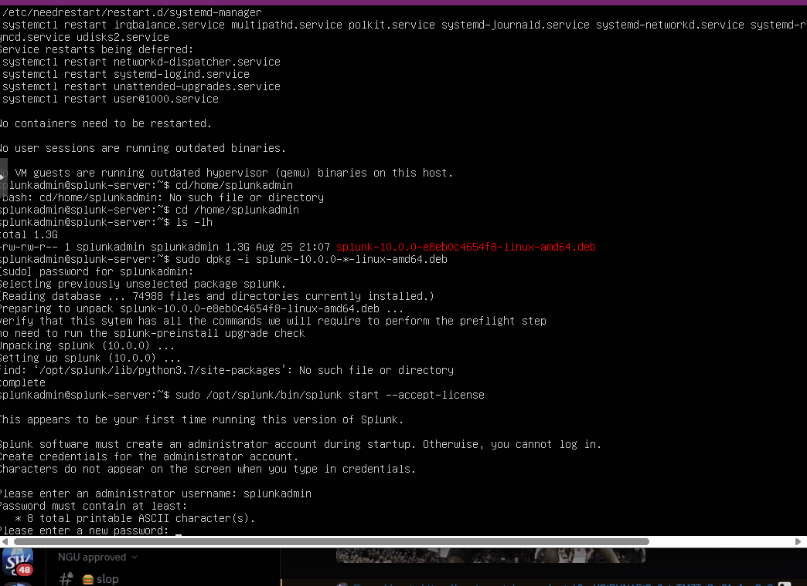

During the first run, Splunk required setting up an admin username and password.  

Finally, Splunk successfully launched and exposed the web interface on port 8000.  
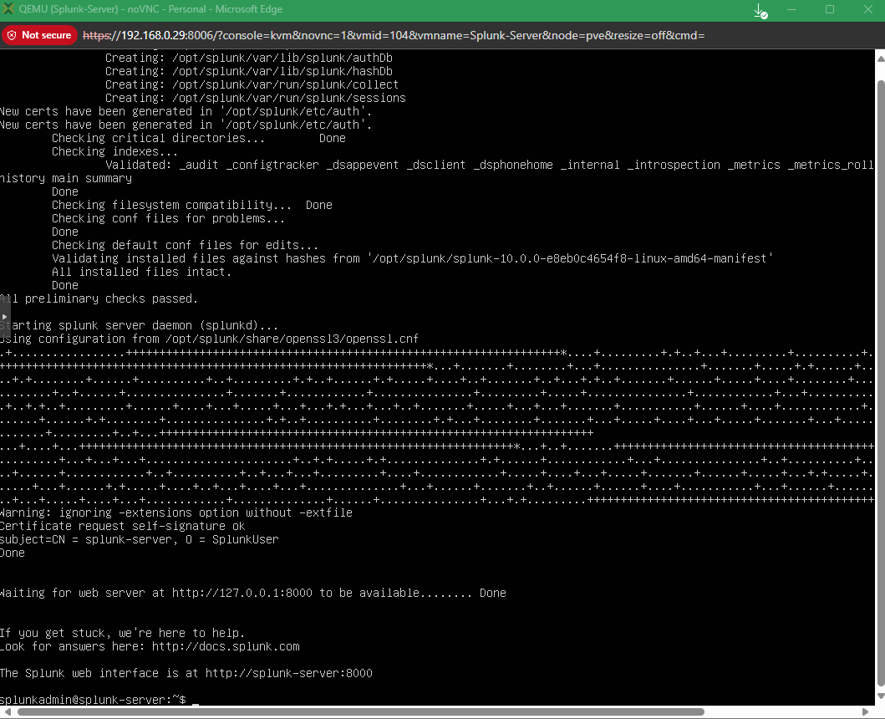

I configured a Proxmox firewall rule to allow inbound traffic to port 8000. Initially, I applied it to vmbr0 since I thought the bridge interface was correct.  
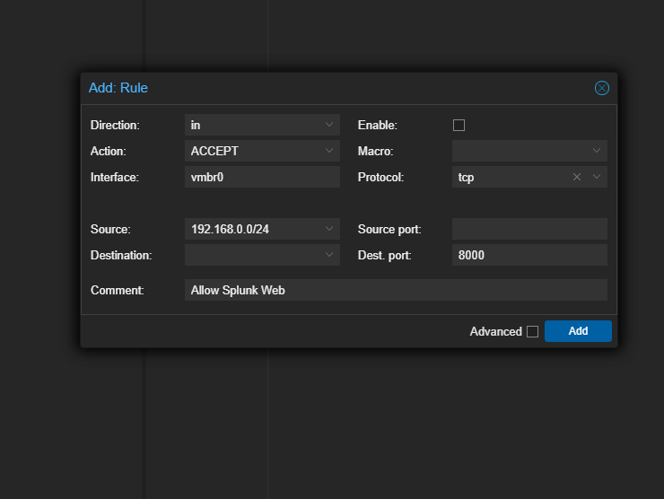

However, I immediately hit a timeout error when trying to reach Splunk Web.  
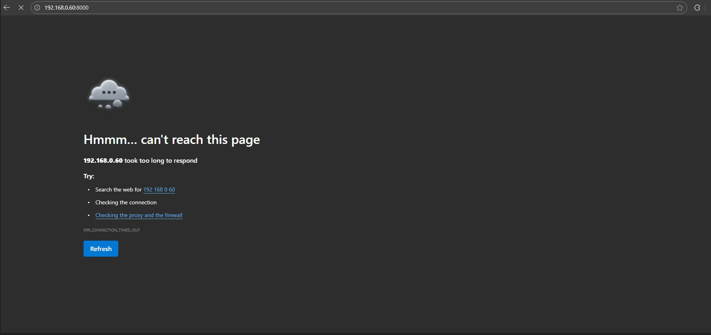

Further errors/clues confirmed traffic wasn’t flowing to the VM correctly.  
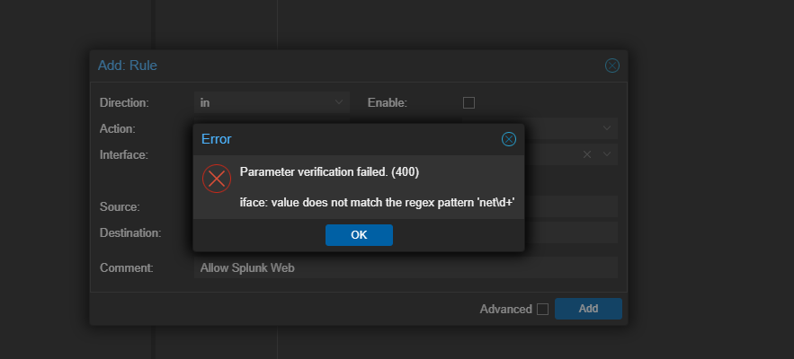  
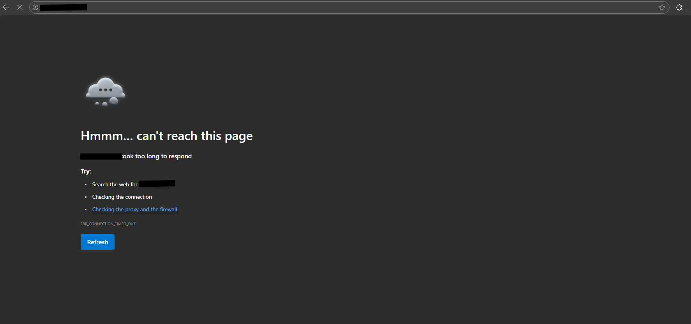

The root issue was that Proxmox firewall rules must be applied to the VM’s NIC (net0) rather than the bridge (vmbr0). When I recreated the rule with the correct net0 interface, traffic passed properly.  
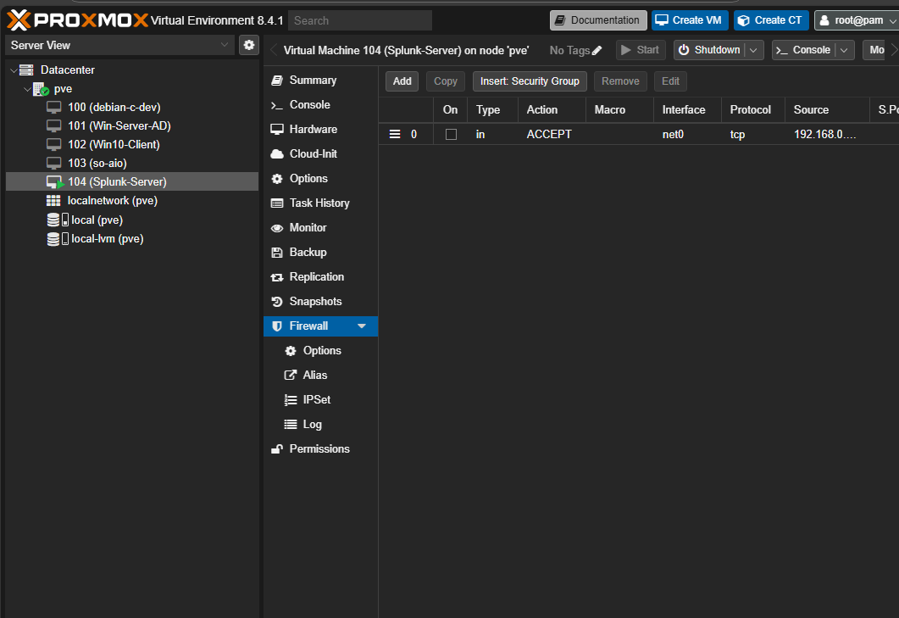

Success — Splunk Web was now reachable at http://192.168.0.60:8000.  
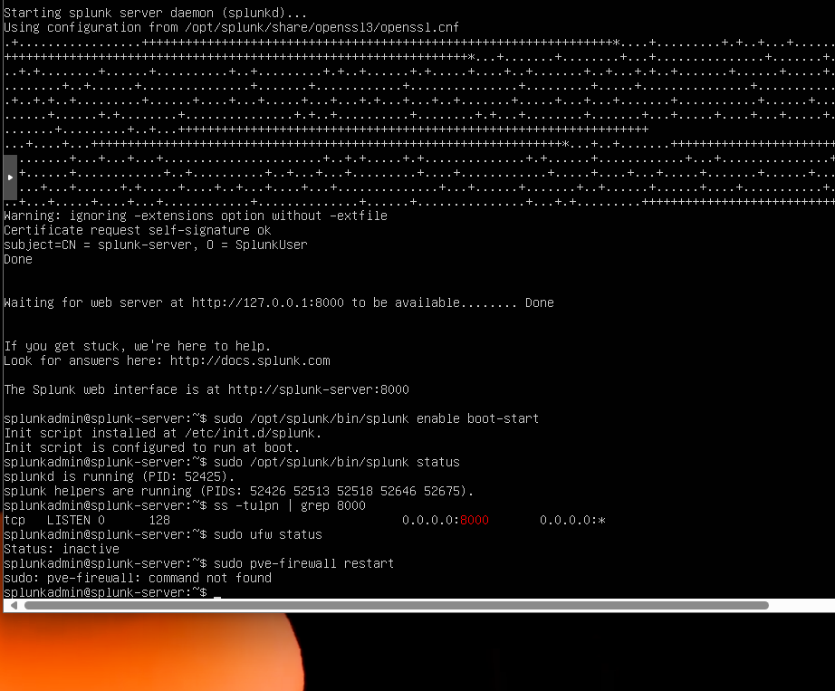

## Root Cause

Splunk is not available in the standard Ubuntu repositories and must be installed manually using the .deb package. Additional configuration was required to:

- Transfer the installer into the VM.  
- Initialize the Splunk service.  
- Open firewall rules for external access.  
- Correct firewall misconfiguration (vmbr0 vs net0).

## Fix Applied / Configuration Made

- Configured static IP, DNS, and gateway.  
- Copied Splunk .deb package via scp.  
- Installed Splunk with dpkg -i.  
- Accepted license and created the splunkadmin account.  
- Started Splunk daemon.  
- Corrected firewall rule to apply on net0 instead of vmbr0.  
- Opened TCP port 8000 on the Proxmox firewall.  

## Lesson Learned

- Always assign a static IP to server VMs to avoid connectivity issues with Splunk Web.  
- Using scp is the most straightforward method to transfer installers into a Proxmox VM.  
- Proxmox firewall rules must target the VM NIC (net0), not the bridge (vmbr0). Misplacing the rule will block access even if Splunk is listening.  
- Splunk requires an admin account to be created on first startup—this must be documented for repeatability.  
