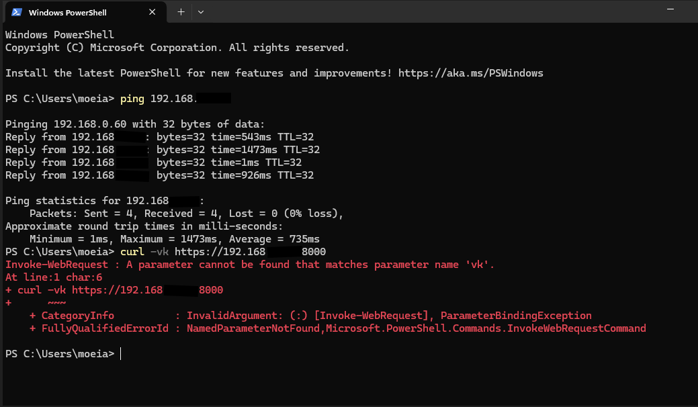
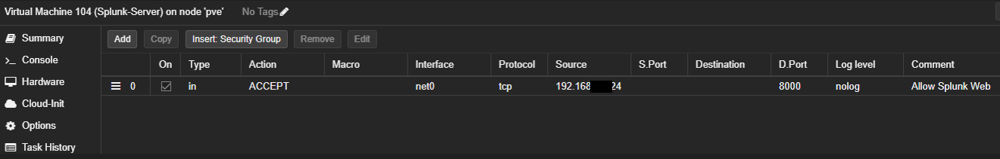

# Step 10 – Enable Splunk HTTPS & Static IP Correction
## Context  

After enabling Splunk Web to run on HTTPS, I discovered I could not reach the login page from my workstation. At first I suspected firewall issues in Proxmox, but testing revealed the Splunk server was bound only to localhost and its IP address wasn’t properly aligned with the rest of my lab network. This step was about fixing Splunk’s networking by assigning a proper static IP, correcting YAML errors, and confirming HTTPS access externally.  

## Screenshots  

First, I attempted to curl Splunk over HTTPS but received redirects and timeouts.  
  

I double-checked Proxmox firewall rules to allow TCP port 8000 inbound.  
  

Inside the VM, I opened the netplan configuration file to assign a static IP.  
  

The first attempt threw an “Invalid YAML: inconsistent indentation” error.  
  

After correcting indentation for the `routes` section, netplan applied successfully.  
  

I verified the new static IP (`192.168.X.X/24`) on interface enp6s18.  
  

Finally, a curl test against `https://192.168.X.X:8000` returned an HTTP 303 redirect, confirming Splunk Web was reachable via HTTPS.  
  

To confirm visually, I logged into Splunk Web over HTTPS and reached the dashboard.  
  

## Root Cause  

Splunk was initially running on `127.0.X.X` with a DHCP-assigned IP (`192.168.X.X`). Even after firewall rules were opened, the service was unreachable externally because:  
- The VM did not have a properly defined static IP,
- The Network ID did not match the rest of the network.  
- Netplan YAML was mis-indented, causing route conflicts.  
- HTTPS introduced a redirect that made testing harder to interpret at first.  

## Fix Applied / Configuration Made  

- Confirmed VM NIC (`enp6s18`) with `ip a`.  
- Edited `/etc/netplan/00-installer-config.yaml` to set a static IP (`192.168.X.X/24`), gateway (`192.168.X.X`), and DNS.  
- Corrected YAML indentation for the `routes` block.  
- Applied config with `sudo netplan apply`.  
- Removed the old DHCP address manually with `ip addr del`.  
- Verified Splunk responded on the new static IP using curl.  

## Lesson Learned  

- Always check NIC name with `ip a` before editing netplan.  
- YAML is strict — even one space misaligned will cause errors.  
- A firewall rule won’t help if the VM itself isn’t configured with the correct IP.  
- Splunk’s HTTPS Web UI shows an HTTP 303 redirect when working correctly.  
- Assigning a static IP prevents conflicts and ensures Splunk stays reachable for both management and log ingestion.  
