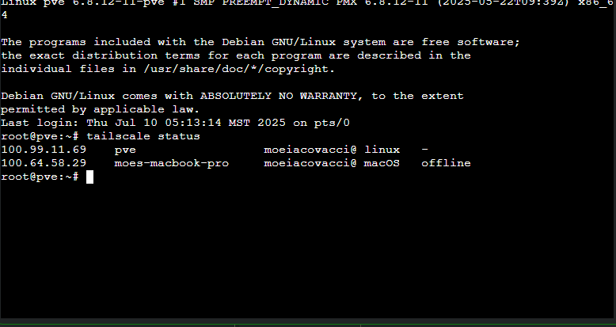

# Step 2 – Tailscale Remote Access Setup  

**Context (what I was doing):**  
After resolving the Proxmox repository update failure, I set up **Tailscale** to allow remote access to my Intel NUC Proxmox host. This lets me manage the SOC lab from anywhere as if I’m on my home LAN, without port forwarding or a dedicated VPN.  

**Screenshot:**  
  

**Root Cause (why this step was needed):**  
Proxmox was only accessible on the home LAN (`192.168.0.x`). Remote access was needed for easier troubleshooting and lab management.  

**Fix Applied / Action Taken:**  
1. Installed and authenticated Tailscale on the Proxmox host.  
2. Verified connectivity with `tailscale status`, confirming both the Proxmox host (`pve`) and my Mac were on the Tailscale network.  

**Lesson Learned:**  
- Tailscale provides a secure, quick way to access Proxmox remotely.  
- No need for complex VPN or firewall changes — great for lab environments.  
- This also sets the stage for accessing isolated lab services later.  
