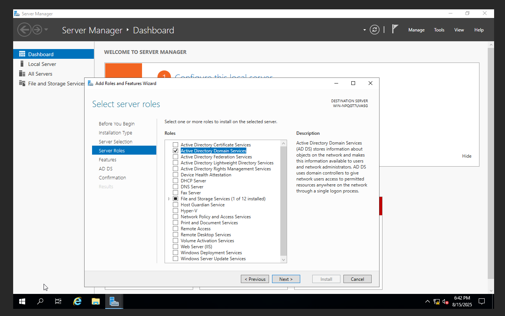
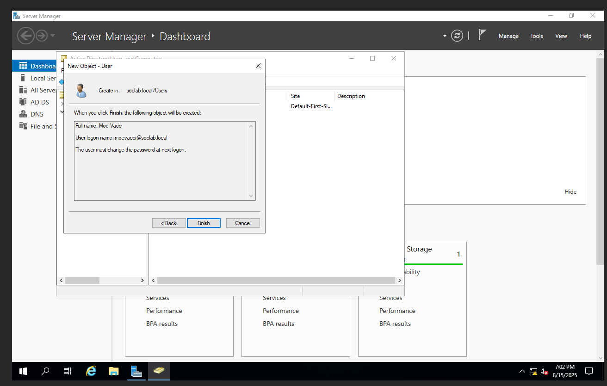

# Step 4 – Active Directory Domain Services (AD DS) Setup  

**Context (what I was doing):**  
I was configuring the Windows Server 2019 VM to act as a Domain Controller for the lab environment. This required adding the Active Directory Domain Services (AD DS) role, completing the prerequisites, and creating the first domain (`soclab.local`).  

---

**Screenshots and Walkthrough:**  

First, I launched the **Add Roles and Features Wizard** and chose a role-based installation.  
  

Next, I selected the **Active Directory Domain Services** role under Server Roles.  
  

Once installed, **Server Manager** flagged that additional configuration was required to promote the server to a Domain Controller.  
  

The **Prerequisites Check** confirmed that the configuration could proceed. There were warnings about static IP addresses and cryptography settings, but these were acceptable for a lab environment.  
  

After the promotion completed, I opened **Active Directory Users and Computers (ADUC)** and confirmed the new domain `soclab.local` appeared with the server listed under Domain Controllers.  
  

Finally, I created a new test user (`moevacci@soclab.local`) to validate that the domain was functional.  
  

---

**Root Cause (why this step was needed):**  
The SOC lab required a centralized directory service to manage users, computers, and authentication across the isolated lab network. Without AD DS, the environment would lack domain-level security policies and account management.  

---

**Fix Applied / Configuration Made:**  
1. Opened **Server Manager** → *Add Roles and Features Wizard*.  
2. Selected **Role-based or feature-based installation**.  
3. Chose **Active Directory Domain Services (AD DS)** role.  
4. Installed required management tools when prompted.  
5. Completed the **AD DS Configuration Wizard** and promoted the server to a domain controller for `soclab.local`.  
6. Verified the new domain appeared in **Active Directory Users and Computers (ADUC)**.  
7. Created a new test user account (`moevacci@soclab.local`) to validate functionality.  

---

**Lesson Learned:**  
- Always install AD DS with the management tools option enabled, otherwise required snap-ins will be missing.  
- The **Prerequisites Check** may warn about cryptography policies and static IP addresses—these should be addressed later for production, but can be bypassed in a lab setup.  
- Verifying the domain in ADUC ensures the promotion step completed successfully.  
- Creating a test user right away helps confirm domain functionality before moving on to workstation joins.  
