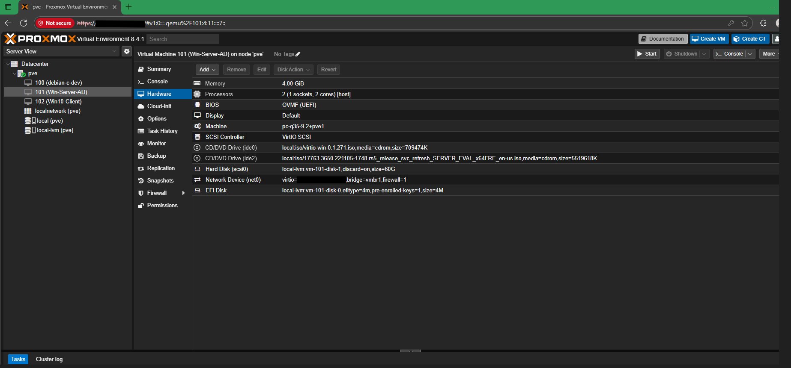

# Step 5 – Windows 10 Client VM Setup

As part of building the SOC lab, a Windows 10 client VM was installed on Proxmox to act as a test endpoint and domain-joined client. This VM will later connect to the Windows Server AD/DC for domain management and SOC monitoring.

---

## VM Creation

- Created new VM with the following configuration:
  - Name: **Win10-Client**
  - OS: Windows 10 (x64 ISO)
  - Machine type: `pc-q35-9.2+pve1`
  - BIOS: OVMF (UEFI)
  - SCSI Controller: VirtIO SCSI
  - Hard Disk: 60GB (VirtIO SCSI)
  - Network Device: VirtIO (bridge=vmbr1)
  - Memory: 4GB
  - CPU: 4 cores

**Screenshot – Confirm VM Settings**

---

## Hardware Configuration

After creation, verified VM hardware in Proxmox:

- `CD/DVD Drive (ide0)` → VirtIO ISO  
- `CD/DVD Drive (ide2)` → Windows 10 installation ISO  
- `Hard Disk (scsi0)` → 60GB  
- `Network Device (net0)` → VirtIO NIC on isolated bridge (vmbr1)  

**Screenshot – VM Added to Proxmox**

---

## Next Steps

- Installed Windows 10 using VirtIO drivers (see [Error 4 – VirtIO Driver “No Signed Device Drivers” During Windows 10 Client Setup](error-4-virtio-driver-nosigned.md) for details).  
- Confirmed that VM successfully booted into Windows 10 after drivers were loaded.  
- Verified NIC and Balloon drivers installed inside the client VM.  
