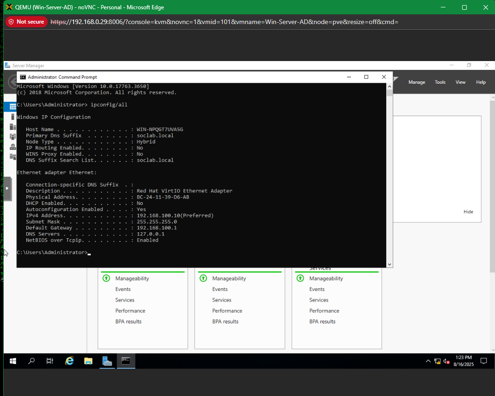
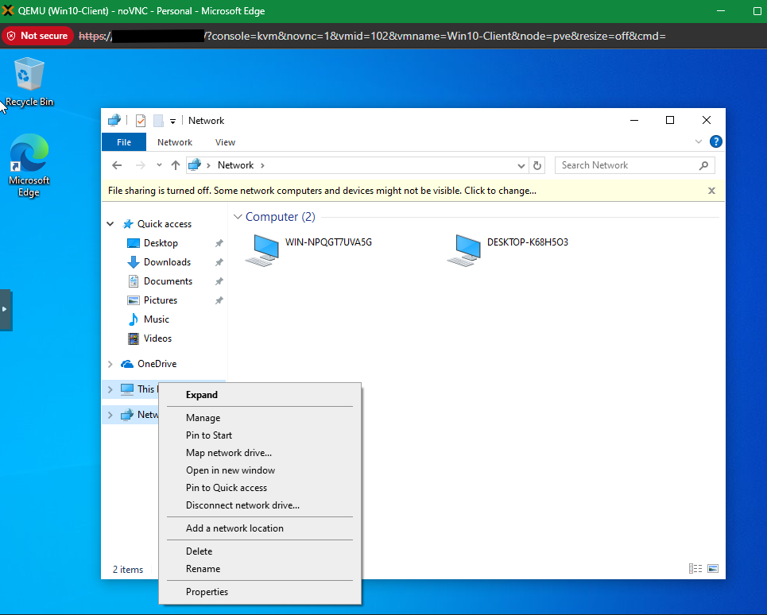
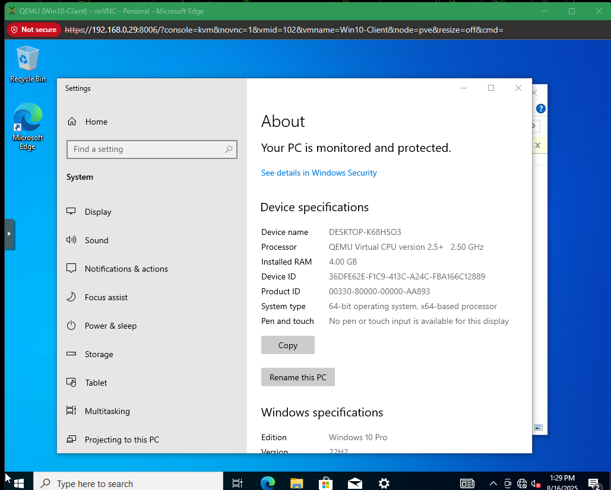
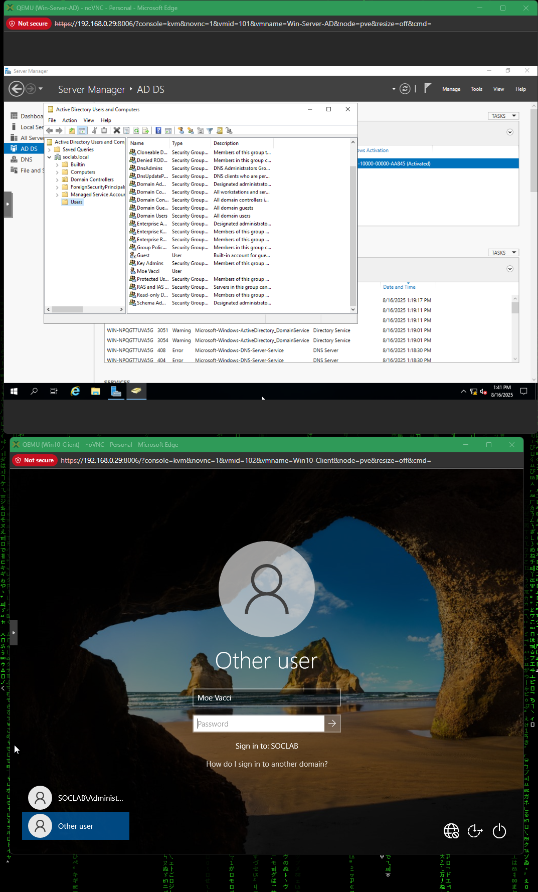
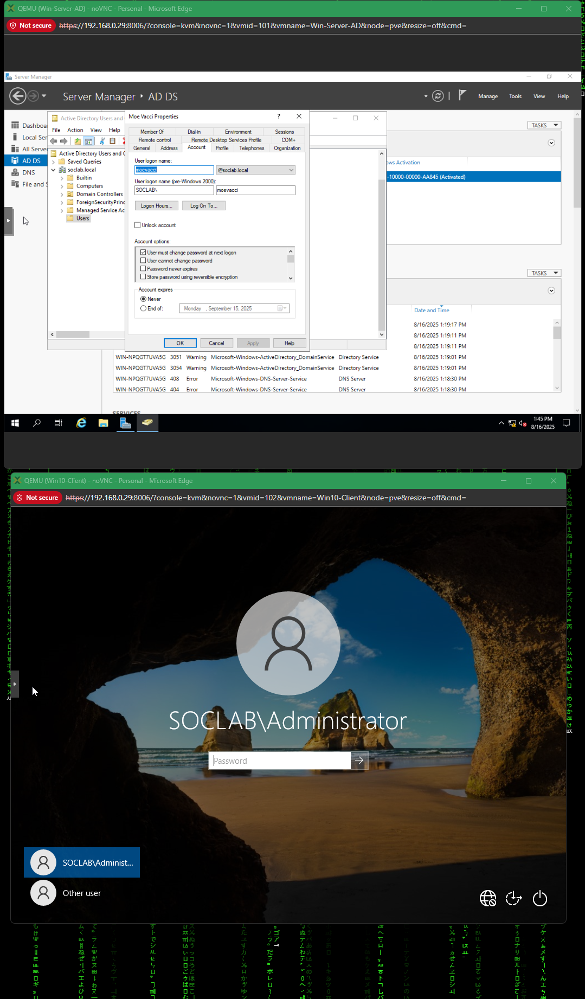
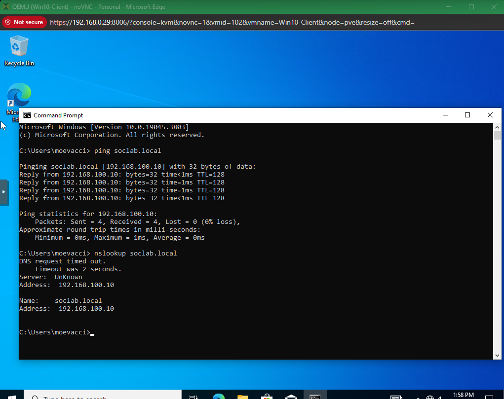
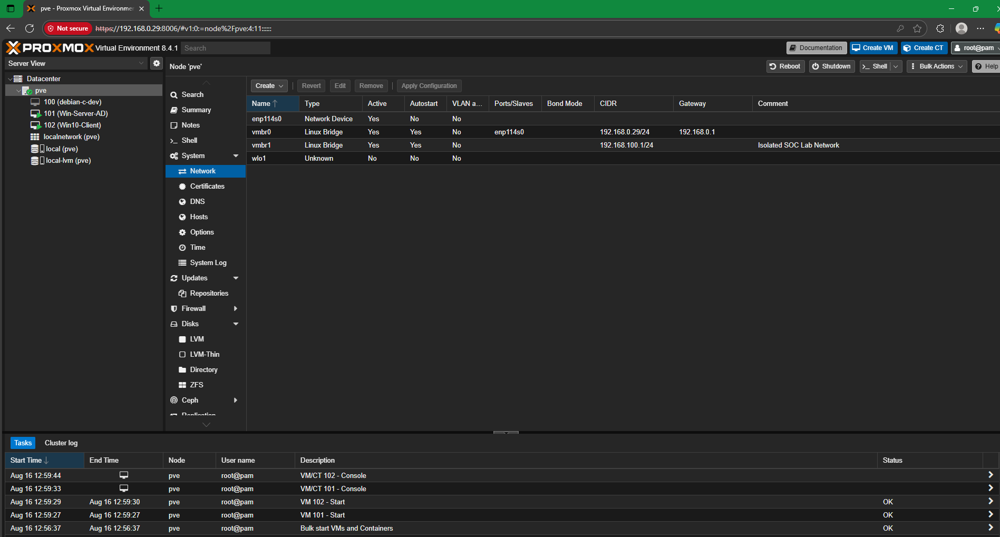

Step 7 – AD DS Domain Join
Context (what I was doing)

I was configuring the Windows Server 2019 VM as an Active Directory Domain Controller (AD DS) with DNS and then joining a Windows 10 client machine to the soclabs.local domain. The goal was to enable centralized authentication and validate that domain services were functioning end-to-end within the isolated SOC lab network.

## Screenshots  

First, I verified the Windows Server IP configuration with DNS set to loopback and the suffix `soclabs.local`.  
  

Next, I opened the Windows 10 client’s Network view and confirmed that the server hostname was visible.  
  

I then checked the Windows 10 client device specifications before renaming it and joining it to the domain.  
  

On the domain controller, I created a new user (`Moe Vacci`) in Active Directory Users and Computers.  
  

On the Windows 10 client login screen, I attempted to sign in with the new domain account.  
  

I reviewed the properties of the domain user (`moevacci@soclabs.local`) to verify account details.  
  

I tested connectivity from the client. Pinging `soclabs.local` succeeded, but initial `nslookup` queries timed out before eventually resolving the domain controller’s IP.  
  

Finally, I confirmed the Proxmox networking setup showed `vmbr1` configured as the isolated SOC lab network.  
 

Root Cause (why this step was needed)

Active Directory requires DNS for name resolution and authentication. To manage users, policies, and machines in the SOC lab, the Windows Server needed to be promoted to a domain controller and clients needed to be joined to the domain. Without this step, the SOC lab environment would remain a set of standalone machines with no centralized identity or policy control.

Fix Applied / Configuration Made

Promoted the Windows Server to a Domain Controller with AD DS and DNS roles.

Set a static IP (192.168.100.10) and loopback DNS (127.0.0.1) on the server.

Created the domain soclabs.local.

Added a new domain user (Moe Vacci).

On the Windows 10 client: renamed the PC, joined the SOCLAB domain, and verified logon screen options.

Confirmed domain connectivity with ping and nslookup.

Validated network isolation in Proxmox with vmbr1.

Lesson Learned

Ping ≠ DNS: Ping can resolve via cached NetBIOS or hosts, even when DNS is misconfigured. Always test with nslookup or Resolve-DnsName.

Clients must use the domain controller as their DNS server (not the home LAN gateway).

The loopback (127.0.0.1) DNS on the server is correct for a DC, but clients should point to the DC’s IP.

Keeping everything on the vmbr1 isolated bridge ensures the SOC lab stays separated from the home LAN and avoids DNS conflicts.

## Auxiliary Screenshots  

Server Manager AD DS events showing initial warnings/errors after promotion.  
  
